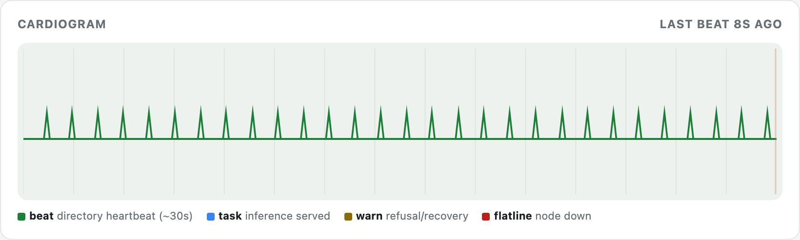
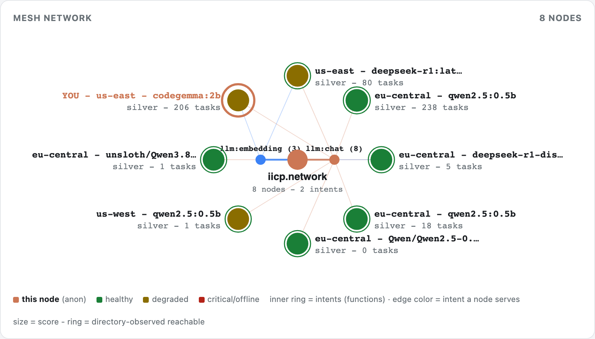
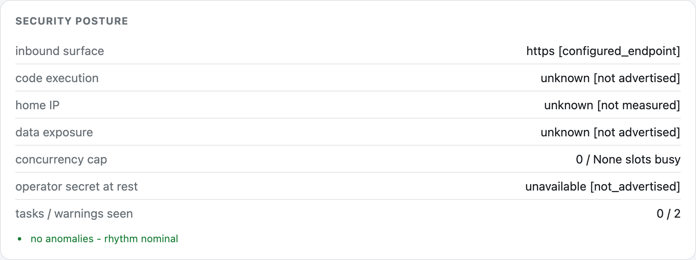
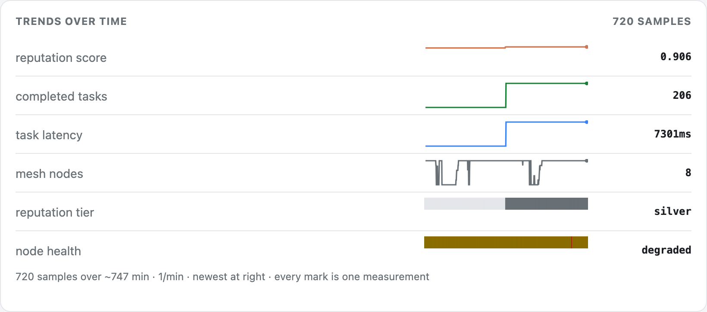

# iicp-node-monitor

A single-file, dependency-free live dashboard for an [IICP](https://iicp.network)
mesh node. It shows a cardiogram of node activity, a whole-mesh topology graph, a
security-posture panel, and longitudinal trends, all from one stdlib-only Python
file.

IICP is the routing layer of the agent-protocol stack (Orchestration = A2A/ACP,
**Routing = IICP**, Tools = MCP). A node advertises an intent such as
`urn:iicp:intent:llm:chat:v1`, the directory routes typed tasks to it, and this
monitor shows what the node is actually doing.



## Why this exists

Most node dashboards draw a moving waveform whether or not anything is happening.
This one does not. Its design rule is a single constraint:

> **The cardiogram is an honest impulse plot. Node events retain their recorded
> timestamps; derived directory observations are labelled separately and use the
> time at which the monitor observed them. Nothing is backfilled as activity.**

A flat baseline means the node is idle, the truth between roughly 30-second
heartbeats. A green needle is a heartbeat, blue is a served task, amber is a
refusal or recovery check, red is a heartbeat failure, and a red flat line means
the node has actually gone silent (over 90 seconds). A decorative squiggle would
imply activity that did not happen, so there is none. Derived values are labeled
as claims, and stale state is dropped rather than frozen and shown as current.

## What it looks like

The captures below are the live dashboard rendering a running node. Operator
identity and node id are shown as placeholders here; the tool renders your own
node's real values.

### Whole-mesh topology



The directory sits at the center. Each satellite is a live node, sized by routing
score, ringed by directory-observed reachability, and placed by the intents it
serves. This capture shows three nodes because three were heartbeating at that
moment. The graph follows real membership as nodes join and drop, so a thin mesh
is drawn as a thin mesh rather than padded out.

### Security posture



The panel separates measured, configured, directory-reported, inferred and
unavailable facts. It does not assume a Cloudflare tunnel, a particular tool
policy, origin masking, model license or secret-storage mechanism. Unknown state
is reported as unknown rather than converted into a reassuring claim.

### Trends over time



Longitudinal sparklines for reputation score, completed tasks, task latency, mesh
size, reputation tier, and node health. Each mark is one real sample. The step in
completed tasks and the spike in task latency are recorded events, not smoothing,
so you can see when the node's standing actually changed.

## Run it

```sh
python3 node-stats-server.py --port 9486 --host 127.0.0.1
open http://127.0.0.1:9486/
```

It resolves the current node dynamically from the configured IICP log directory,
so it survives node-ID and endpoint rotation. Current directories are read through
their privacy-bounded Registry API; older directories retain an explicitly partial
discovery fallback.

The monitor remains independent of the IICP project. It consumes public directory
and node observability interfaces and does not sit in the task execution path.

### Configuration

```sh
python3 node-stats-server.py \
  --directory-url https://directory.example/api \
  --log-dir ~/.iicp/logs \
  --node-health-url http://127.0.0.1:9484/iicp/health \
  --mode private
```

Equivalent environment variables are `IICP_DIRECTORY_URL`, `IICP_LOG_DIR`,
`IICP_NODE_HEALTH_URL`, and `IICP_MODE`. Command-line values take precedence.
Private and federated-private modes require an explicit directory. Local-only
mode performs no directory requests. The monitor never silently falls back to
the public Genesis directory for those modes.

When the node's advertised endpoint is available, `/api.json` also includes an
independent `public_endpoint_reachability` measurement. The monitor requests the
advertised origin's `/iicp/health` route with a short timeout, no redirects and a
bounded response. It refuses credentials, non-HTTPS targets, non-default ports
and non-public IP addresses. This evidence remains separate from both local
runtime health and `directory_observed_reachable`.

### Endpoints

| Path | What |
|---|---|
| `/` | dashboard: cardiogram + mesh graph + security posture + tables |
| `/?mode=screensaver` | ambient full-screen wall monitor (dark, chrome-less) |
| `/api.json` | unified snapshot (local log + directory + mesh + security) |
| `/events.json` | event timeline that drives the cardiogram |
| `/network.json` | whole-mesh topology + per-node stats |

Light and dark themes both ship (CSS variables + `prefers-color-scheme` + a
`data-theme` override). Canvases are device-pixel-ratio aware so text stays crisp.

## Run at login (macOS launchd)

Copy the example plists in `launchd/`, replace the `__HOME__` placeholders with
your home directory, and load them:

```sh
sed "s#__HOME__#$HOME#g" launchd/local.iicp-stats.plist.example \
  > ~/Library/LaunchAgents/local.iicp-stats.plist
launchctl bootstrap gui/$(id -u) ~/Library/LaunchAgents/local.iicp-stats.plist
```

Use the official `iicp-node service install` command for the node itself. It
already writes an absolute path for `iicp-node`; the service does not need shell
`PATH` to find that executable. Older clients may still need an explicit
`IICP_CLOUDFLARED_PATH` so launchd can find Quick Tunnel fallback. Leaving
`IICP_TUNNEL` unset preserves automatic reachability selection; setting it to
`1` forces a tunnel and is not a general launchd fix. The node plist in this
repository is therefore a version-scoped compatibility example, not a
replacement for the official installer.

## Examples

`examples/draft-plus-check.py` shows a cheap, honest use of a small model served
over IICP: a **draft-plus-check** classifier. A small drafter model labels public
text, an independent verifier model labels it too, agreement is accepted, and
disagreement is escalated. The example also documents its own limitation: two
weak, correlated models can agree on a wrong answer, so an ensemble of small
models is a good first-pass and disagreement detector, not a verifier for
anything with stakes.

## Security notes

- The monitor binds to loopback by default. A non-loopback bind exposes
  operational metadata and prints a warning.
- It reads configured local event and health files, public or explicitly selected
  directory views, and the node health endpoint when configured. It never opens
  the operator secret file or node token.
- Never commit `~/.iicp/` contents. Tokens and the operator secret live there and
  stay there. This repo references their *location*, never their value.
- A served node should offer only a public, open-weights model and refuse
  `bash` / `write_file` intents (the IICP default). Do not route private prompts
  to public mesh nodes; a remote executor can read every prompt it runs.

### Data provenance

The dashboard distinguishes these sources:

| Source | Meaning |
|---|---|
| Node event | A timestamped record from `events.jsonl` |
| Runtime endpoint | Current response from `/iicp/health` |
| Runtime snapshot | Local `health-v1.json` state written by the node |
| Registry API | Privacy-bounded directory inventory and aggregate state |
| Directory counter observation | A counter increase seen by the monitor; not an original task event |
| Monitor public-route probe | A bounded, redirect-free HTTPS check of this node's advertised `/iicp/health`; independent of directory evidence |
| Log inference | A compatibility fallback, labelled as inferred |

Unknown event names are neutral rather than healthy. Deployment-specific security
facts are shown only when measured or configured; otherwise the dashboard reports
them as unknown or unavailable.

## Compatibility tests

The test suite is dependency-free:

```sh
python3 -m unittest -v
```

It covers current and legacy registration failures, unknown events, Registry API
inventory and fallback, health precedence, private/local configuration, task-delta
provenance, secret non-access, and HTML injection resistance.

## License

MIT. See `LICENSE`.
